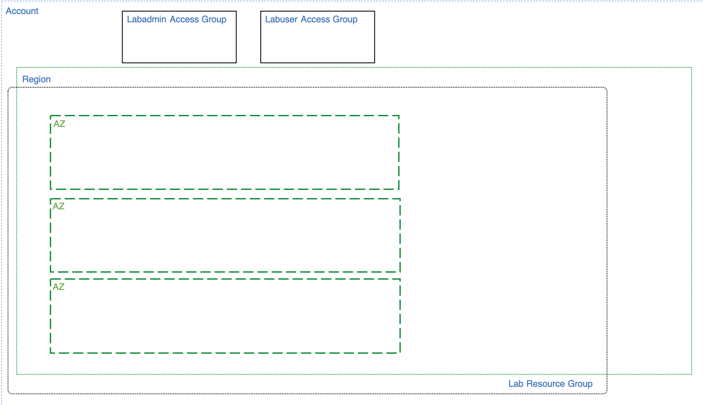

# Access and Resource Control Services

This folder contains the terraform code to implement the *access control layer* of the solution architecture and is executed in an [IBM Cloud Schematics](https://cloud.ibm.com/schematics/overview) workspace.

The first layer of our solution architecture is shown in the diagram below. It contains the 
- resource group where cloud resources will be contained to control access
- access groups that users are assigned and inherit access policies 
- availability zones (AZ) that provide for high availability for network and Kubernetes
- region where the architecture is deployed

## Dependencies

A [Resource Groups](https://cloud.ibm.com/docs/resources?topic=resources-rgs) (variable: `resource_group`) is required before you can provision this layer of the architecture.

## Documentation References
-   [Identity and Access Management (IAM)](https://cloud.ibm.com/docs/iam?topic=iam-getstarted)
-   [Resource Groups](https://cloud.ibm.com/docs/resources?topic=resources-rgs) 
-   [Access Groups](https://cloud.ibm.com/docs/iam?topic=iam-groups)
