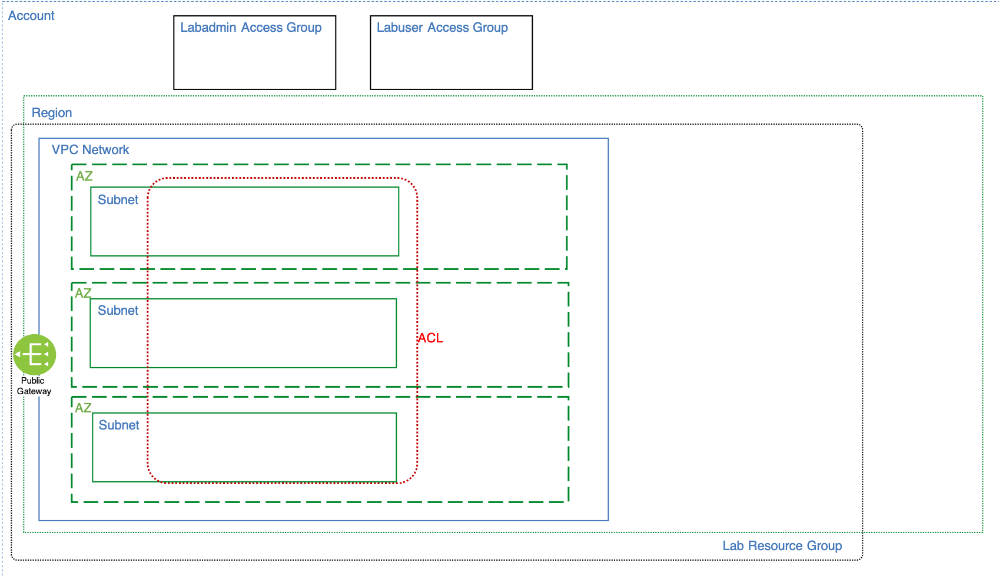

# Networking services

This folder contains the terraform code to implement the *Network Services* layer of the solution architecture and is executed in an [IBM Cloud Schematics](https://cloud.ibm.com/schematics/overview) workspace.

IBM Cloud VPC provides a multi-zone, public and/or private network consisting of load balancers, public gateways, subnets, and access control lists. The diagram reflects the network architecture used in this lab and includes three availability zones (AZ), Virtual Private Cloud (VPC) subnets in each AZ where worker nodes will be deployed, a load balancer (in this case, public) for inbound traffic, and a public gateway for outbound traffic. All services are fully managed.

The diagram below adds the following IBM Cloud resources:
- VPC network in three zones
- Public gateway

## Dependencies
-   The *Workspace ID* (variable: `groups_ws_id`) of the [01-groups](../01-groups) workspace instance.

## Documentation References
-   [IBM Cloud Virtual Private Cloud (VPC)](https://cloud.ibm.com/docs/vpc?topic=vpc-about-vpc)
-   [VPC Load Balancer](https://cloud.ibm.com/docs/vpc?topic=vpc-load-balancers) 
-   [Public Gateway](https://cloud.ibm.com/docs/vpc?topic=vpc-about-networking-for-vpc#external-connectivity)
