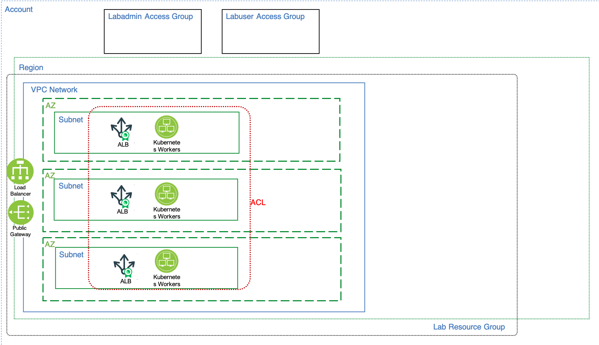

# Kubernetes service

This folder contains the terraform code to implement the *Kubernetes Service* layer of the solution architecture and is executed in an [IBM Cloud Schematics](https://cloud.ibm.com/schematics/overview) workspace.

IBM Cloud Kubernetes service provisions a fully managed Kubernetes cluster into your VPC using the node type/size you select, internal network configuration (NLB, ALB, etc), and worker pools. The container registry manages and secures your images and can be used privately and/or publicly.

The diagram below adds the following IBM Cloud resources:
- the Kubernetes cluster using the IBM Kubernetes services (IKS)
- deployed Load balancing services 
- deployed workers across three zones

## Dependencies
-   The *Workspace ID* (variable: `groups_ws_id`) of the [01-groups](../01-groups) workspace instance.
-   The *Workspace ID* (variable: `vpc_ws_id`) of the [02-vpc](../02-vpc) workspace instance.

## Documentation References
-   [IBM Kubernetes Service (IKS)](https://cloud.ibm.com/docs/containers?topic=containers-getting-started)
-   [IKS Application Load Balancer](https://cloud.ibm.com/docs/containers?topic=containers-loadbalancer-qs) 
-   [IKS VPC worker nodes](https://cloud.ibm.com/docs/containers?topic=containers-planning_worker_nodes#vm)
-   [Identify and Access Control](https://cloud.ibm.com/docs/iam?topic=iam-userroles)