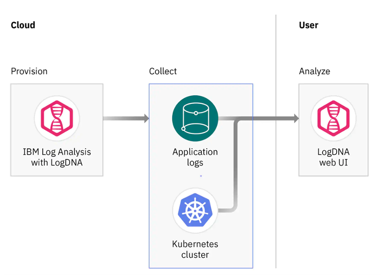

# DevOps/Observability Services

This folder contains the terraform code to implement the *DevOps/Observability Services* layer of the solution architecture and is executed in an [IBM Cloud Schematics](https://cloud.ibm.com/schematics/overview) workspace.

IBM Cloud provides a variety of DevOps services to support full stack automation of your cloud environments, configuration and application workloads. This lab focuses on the use of Terraform in the IBM Cloud Terraform provider with Schematics to automate the provisioning of your environments and you will also explore the monitoring and management services. 

The diagram below adds the following IBM Cloud resources:
- the Schematics and Git repository services for provisioning 
- the Logging, Monitoring and Auditing services

### Logging with LogDNA 

The solution architecture uses LogDNA to collect application logs for any applications that will be deployed into the cluster. 

The terraform in this folder provision an instance of LogDNA, deploy collectors into the cluster and define access policies. With LogDNA you can configure cluster-level logging for a Kubernetes cluster to get access to worker, pod, application and network log types. 

The links below are to the terraform code in this folder for provisioning the logging capability for the cluster and applications deployed into the cluster.
  - [LogDNA and access key](logging.tf)
  - [Create ingestion key and deploy the daemonset](log.tf)
  

### Monitoring with SysDig

The solution architecture uses monitoring with sysdig service to monitoring cluster infrastructure and applications.  The terraform in this folder provisions the instance of Sysdig and daemonsets into the cluster. 

The links below are to the terraform code in this folder for provisioning the monitoring capability for the cluster and applications deployed into the cluster
  - [Monitoring and access key](monitoring.tf)
  - [Deploy monitoring daemonset](monitor.tf)
  
## Dependencies
-   The *Workspace ID* (variable: `groups_ws_id`) of the [01-groups](../01-groups) workspace instance.
-   The *Workspace ID* (variable: `iks_ws_id`) of the [03-iks](../03-iks) workspace instance.

## Documentation References
-   [Git repository](https://cloud.ibm.com/docs/ContinuousDelivery?topic=ContinuousDelivery-git_working)
-   [IBM Cloud Schematics](https://cloud.ibm.com/docs/schematics?topic=schematics-about-schematics) 
-   [LogDNA](https://cloud.ibm.com/docs/containers?topic=containers-health#logging_overview)
-   [Sysdig Monitoring](https://cloud.ibm.com/docs/Monitoring-with-Sysdig?topic=Sysdig-about)
-   [Activity Tracker](https://cloud.ibm.com/docs/containers?topic=containers-at_events)