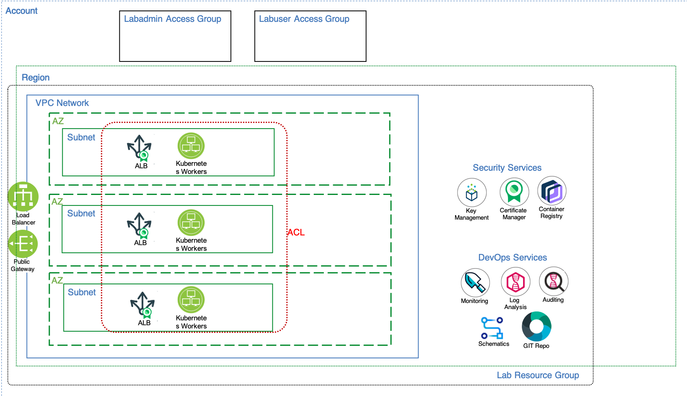
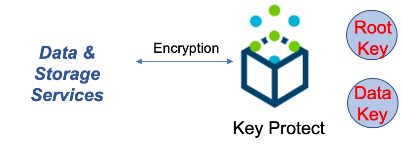

# Security Services

This folder contains the terraform code to implement the *Security Services - Key Protect* layer of the solution architecture and is executed in an [IBM Cloud Schematics](https://cloud.ibm.com/schematics/overview) workspace.

IBM Cloud security services used in this lab include Key Protect used to manage encryption keys for data at rest. Certificate manager manages the SSL certificates for data in motion. Container registry includes a set of security services for your container images. 

The diagram below adds the following IBM Cloud resources:
- the Key Protect service for encryption key management
- The Container registry to manage images and security 
- The Certificate Manager services for SSL certificates

### Key Protect

Key Protect enables you to provision and manage the lifecycle of encrypted keys for applications across IBM Cloud services. The service enables you to wrap (encrypt) your data encryption keys with a highly secure root key. You can bring your own root keys or create them in the service.

## Dependencies
-   The *Workspace ID* (variable: `groups_ws_id`) of the [01-groups](../01-groups) workspace instance.

## Documentation References
-   [Key Protect](https://cloud.ibm.com/docs/key-protect?topic=key-protect-about)
-   [Certificate Management Service](https://cloud.ibm.com/docs/services/certificate-manager?topic=certificate-manager-getting-started) 
-   [IBM Container Registry](https://cloud.ibm.com/docs/Registry?topic=va-va_index)
