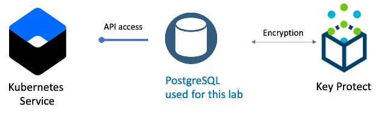

# PostgreSQL Database

This folder contains the terraform code to implement the *PostgreSQL Database* layer of the solution architecture and is executed in an [IBM Cloud Schematics](https://cloud.ibm.com/schematics/overview) workspace.

### Manage Multiple Teams

One of the benefits of using Kubernetes cluster in a public cloud is the abiltiy to manage multiple teams within the cluster supporting a multi-tenant model. Using Schematics and terraform scripts, you can componentize the architecture automation to create one or more namespaces ([10-team_iks_namespace](../10-team_iks_namespace)),  object storage buckets ([09-team_cos_bucket](../09-team_cos_bucket)) or Postgresql databases ([08-team-database](../08-team-database)). The components are implemented in IBM Cloud with Schematics workspaces, Terraform scripts and folders within the git repository.  Benefits include: 

- maintain the terraform scripts in one folder for each of these components in the git repository 
- create a Schematics workspace for each **instance** of those components
- provision, change and deprecate the component instances through the workspace
- use the output variables and schematics data blocks to retrieve parameters from other workspaces

### PostgreSQL Database

IBM Cloud Databases for PostgreSQL is a managed PostgreSQL database-as-a-service that lets teams spend more time building, with high availability, backup orchestration, Point-In-Time-Recovery (PITR), and read replica at the push of a button. PostgreSQL is an object-relational SQL database, complemented by powerful enhancements like indexable JSON, publish/subscribe functions and drivers.

In this terraform folder the PostgreSQL database is provisioned, configured and bound to the IKS cluster workspace and the team is provided access through an access policy, see [access_policies_resource.tf](access_policies_resource.tf). 

## Dependencies
-   The *Workspace ID* (variable: `groups_ws_id`) of the [01-groups](../01-groups) workspace instance.
-   The *Workspace ID* (variable: `key_ws_id`) of the [04-key_protect](../04-key_protect) workspace instance.

## Documentation References
-   [Key Protect](https://cloud.ibm.com/docs/key-protect?topic=key-protect-about)
-   [Database PostgreSQL](https://cloud.ibm.com/docs/databases-for-postgresql?topic=cloud-databases-provisioning) 
