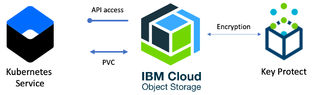

# Object Storage

This folder contains the terraform code to implement the *Object Storage* layer of the solution architecture and is executed in an [IBM Cloud Schematics](https://cloud.ibm.com/schematics/overview) workspace.

### Manage Multiple Teams

One of the benefits of using Kubernetes cluster in a public cloud is the abiltiy to manage multiple teams within the cluster supporting a multi-tenant model. Using Schematics and terraform scripts, you can componentize the architecture automation to create one or more namespaces ([10-team_iks_namespace](../10-team_iks_namespace)),  object storage buckets ([09-team_cos_bucket](../09-team_cos_bucket)) or Postgresql databases ([08-team-database](../08-team-database)). The components are implemented in IBM Cloud with Schematics workspaces, Terraform scripts and folders within the git repository.  Benefits include: 

- maintain the terraform scripts in one folder for each of these components in the git repository 
- create a Schematics workspace for each **instance** of those components
- provision, change and deprecate the component instances through the workspace
- use the output variables and schematics data blocks to retrieve parameters from other workspaces

### Object Storage

IBM Cloud Object Storage (COS) makes it possible to store practically limitless amounts of data, simply and cost effectively. It is commonly used for data archiving and backup, web and mobile applications, and as scalable, persistent storage for analytics. In this lab architecture, applications will access the object storage bucket using an API. Use the [planning storage documentation](https://cloud.ibm.com/docs/containers?topic=containers-storage_planning) for recommended practices with persistent and non-persisrtent storage.

In this terraform folder a single, regional bucket is created in the Object Storage Instance (provisioned in [06-team_cos_bucket](../06-team_cos_bucket)) and the team is provided access through an access policy, see [access_policies_resource.tf](access_policies_resource.tf). 

## Dependencies
-   The *Workspace ID* (variable: `groups_ws_id`) of the [01-groups](../01-groups) workspace instance.
-   The *Workspace ID* (variable: `iks_ws_id`) of the [03-iks_cluster](../03-iks_cluster) workspace instance.
-   The *Workspace ID* (variable: `key_ws_id`) of the [04-key_protect](../04-key_protect) workspace instance.
-   The *Workspace ID* (variable: `cos_ws_id`) of the [06-team_cos_bucket](../06-team_cos_bucket) workspace instance.

## Documentation References
-   [Object Storage](https://cloud.ibm.com/docs/containers?topic=containers-object_storage)
