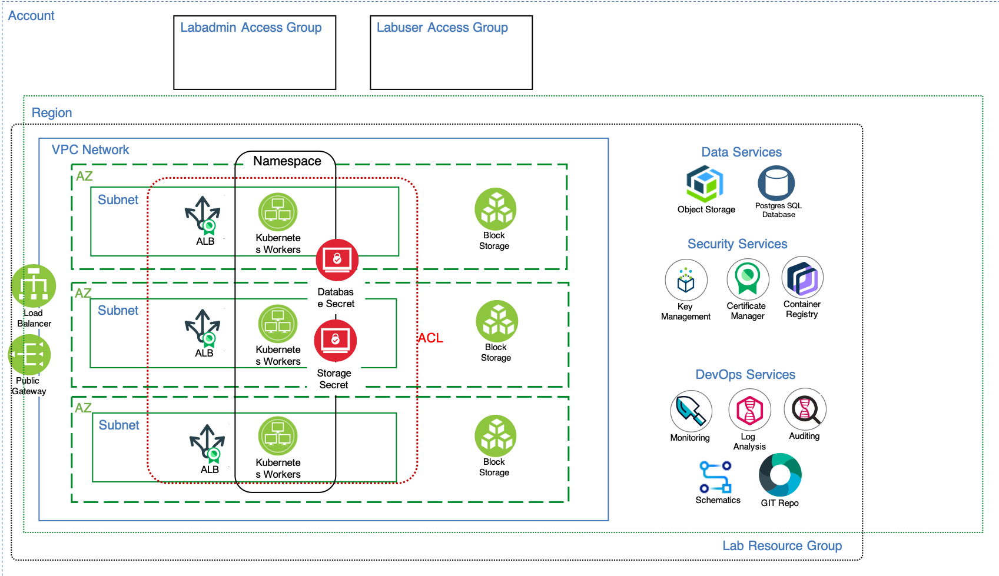

# VPC And Infrastructure as Code (IaC) on IBM Cloud 

This repo contains the terraform code used to provision the environment for the  [VPC And Infrastructure as Code (IaC) on IBM Cloud](https://developer.ibm.com/openlabs/vpc) course. 

This architecture supports an architecture layered approach that is easily automated using Terraform and the IBM Cloud  [IBM Cloud Schematics](https://cloud.ibm.com/schematics/overview) workspaces.

See the course [VPC and Infrastructure as Code (IaC) on IBM Cloud](https://developer.ibm.com/openlabs/vpc) for an explanation of the architecture and details of this terraform code.
